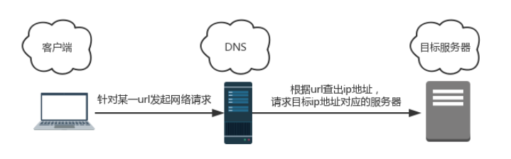
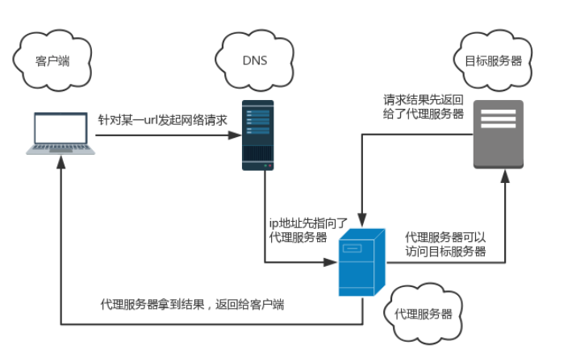

#### 代理模式

出于某种考虑/限制，一个对象不能**直接访问**另一个对象，需要一个第三者（代理）牵线搭桥从而间接达到访问目的，这样的模式就是代理模式


##### ~科学上网背后的故事

VPN（虚拟专用网络）。

正常情况下访问Google.com=》无法访问

**一般情况下，当访问一个url时，会发生以下过程：**



DNS的解析过程被处理（目标ip被禁），DNS返回查找不到。

**通过访问VPN，可以访问到Google.com，背后就是代理模式。访问过程如下：**



比起常规的访问过程，多出了一个第三方——代理服务器，请求到Google.com后，将响应体转发回来，使得以间接地访问到目标网址。类似这种第三方代替我们访问目标对象的模式，就是代理模式。


##### ~婚介所的故事

婚恋网站。只能看到其他人的简单信息，需要付费成为VIP才能得到更多信息。

不能与他人直接进行沟通，能够获取到的信息和权限，取决于第三方愿意给他什么。


##### ~用代理模式开一家婚介所

**前置知识：ES6中的Proxy**

在ES6中，提供了专门以代理角色出现的代理器——Proxy。基本用法如下：

```javascript
const proxy = new Proxy(obj, handler)
```

第一个参数是目标对象，相当于上文中的他人。handler也是一个对象，用来定义**代理的行为**，相当于婚介所。

当通过proxy去访问目标对象的时候，handler会对我们的行为作一层拦截，每次访问都要经过handler这个第三方。

**婚介所的实现**

妹子信息大致如下：

```javascript
const girl = {
  name: '...',
  aboutMe: '',
  age: 24,
  career: '',
  fakeAvatar: '',
  avatar: '',
  phone: '...'
}
```

基本信息，公开

私密信息，实名审核

联系方式，VIP

getter层面的拦截（获取信息）。setter层面的拦截（如每个会员愿意接受的礼物的下限）

