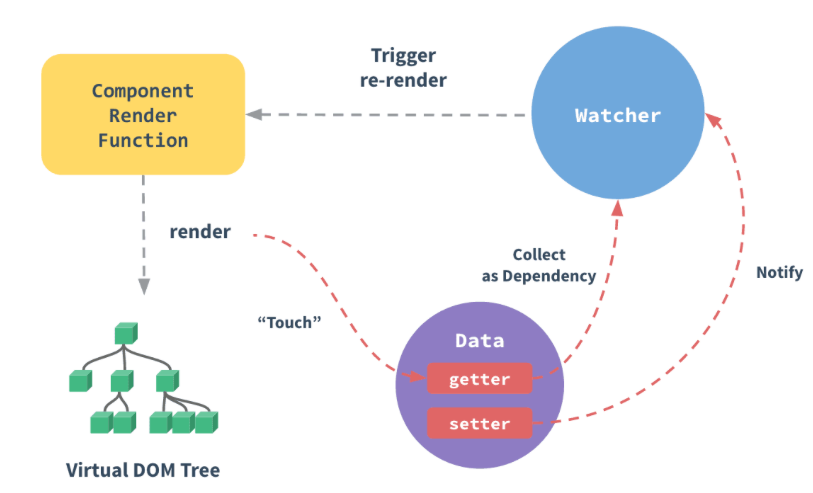
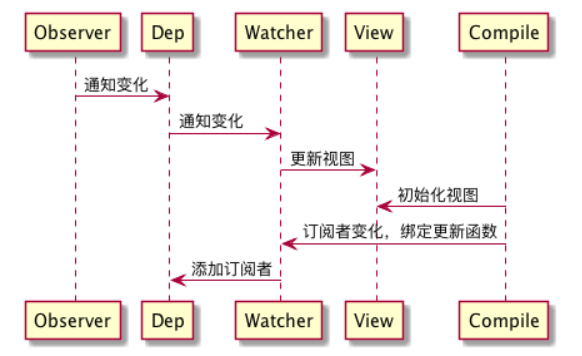
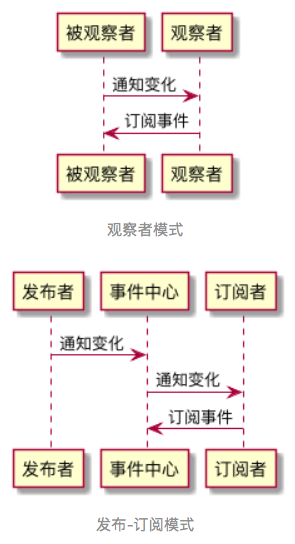

#### 观察者模式——面试真题

超高频考点


####~Vue数据双向绑定（响应式系统）的实现原理

**解析**：

Vue：渐进式JavaScript框架

在Vue中，当我们修改状态时，视图会随之更新，这就是Vue的数据双向绑定（又称响应式原理）。数据双向绑定是Vue最独特的特性之一。[Vue官方对响应式原理的介绍](https://cn.vuejs.org/v2/guide/reactivity.html)。以下是官方的一张流程图，用来简要地说明一下Vue响应式系统的整个流程：



在Vue中，每个组件实例都有相应的watcher实例对象，它会在组件渲染的过程中，把属性记录为依赖，之后当依赖项的setter被调用时，会通过watcher重新计算，从而致使它关联的组件得以更新——典型的观察者模式。

考察对Vue底层原理的理解、对观察者模式的实现能力以及一系列重要的js知识点。

深入Vue框架的相关知识，建议阅读：[Vue源码](https://github.com/vuejs/vue)、[专门写Vue的小册](https://juejin.im/book/6844733705089449991)

这里针对Vue响应式系统中与观察者模式紧密关联的这部分作讲解。

**在Vue数据双向绑定的实现逻辑里，有三个关键角色**：

* observer（监听器）：在Vue数据双向绑定的角色结构里，所谓的observer**不仅是**一个数据监听器，它还需要对监听到的数据进行转发——即它**同时还是**一个发布者。
* watcher（订阅者）：observer把数据转发给了**真正的订阅者**——watcher对象。watcher接收到新的数据后，会去更新视图。
* compile（编译器）：MVVM框架特有的角色，负责对每个节点元素指令进行扫描和解析，指令的数据初始化、订阅者的创建这些“杂活”也归它管

这三者的配合过程如下图所示：



**核心代码**：

* 实现observer

  首先需要实现一个方法，对需要监听的数据对象进行遍历、给它的属性加上定制的getter和setter函数。这样但凡这个对象的某个属性发生了改变，就会触发setter函数，进而通知到订阅者。这个setter函数，就是我们的监听器。

* 实现订阅者Dep

* 改写defineReactive中的setter方法，在监听器里去通知订阅者了


#### ~实现一个Event Bus/Event Emitter

Event Bus（在Vue、Flutter等前端框架中出现）和Event Emitter（在Node中出现），都对应一个共同的角色——**全局事件总线**。

全局事件总线，严格来说不能说是观察者模式，而是发布-订阅模式

**在Vue中使用Event Bus来实现组件间的通讯：**

Event Bus/Event Emitter作为全局事件总线，它起到的是一个**沟通桥梁**的作用。可以把它理解为一个事件中心，所有事件的订阅/发布都不能由订阅方和发布方“私下沟通”，必须要委托这个事件中心帮我们实现。

在Vue中，有时A组件和B组件隔了很远，如果希望他们能够通信，除了使用Vuex，还可以用个Event Bus来实现我们的需求。

* 创建一个Event Bus（本质上也是Vue实例）并导出

  ```javascript
  const EventBus = new Vue();
  export default EventBus;
  ```

* 在主文件中引入EventBus，并挂载到全局：

  ```javascript
  import bus from 'EventBus文件路径';
  Vue.prototype.bus = bus;
  ```

* 订阅事件：

  ```javascript
  // 这里func指someEvent这个事件的监听函数
  this.bus.$on('someEvent', func);
  ```

* 发布（触发）事件：

  ```javascript
  // 这里params指someEvent这个事件被触发时回调函数接收的入参
  this.bus.$emit('someEvent', params);
  ```

整个调用过程中，没有出现具体的发布者和订阅者（类似PrdPublisher和DeveloperObserver），全程只有bus在搞事情。这就是全局事件总线的特点——所有事件的发布/订阅操作，必须经由事件中心，禁止一切“私下交易”。

**实现一个Event Bus**

observer-3-emitter.js

拓展阅读：[FaceBook推出的通用EventEmitter库](https://github.com/facebook/emitter)


#### ~观察者模式与发布-订阅模式的区别

两者在核心思想、运作机制上没有本质的差别

**观察者模式**：发布者**直接触及**到订阅者的操作

**发布-订阅模式**：发布者**不直接触及到**订阅者、而是由统一的第三方来完成实际的通信的操作

所以，两者之间的区别，在于是否存在第三方、发布者能否直接感知订阅者



**观察者模式**，解决的其实是模块间的耦合问题，有它在，即便是两个分离的、毫不相关的模块，也可以实现数据通信。但，观察者模式仅仅是减少了耦合，并没有完全地解决耦合问题——被观察者必须去维护一套观察者的集合，这些观察者必须实现统一的方法供被观察者调用。

而**发布-订阅模式**——发布者完全不用感知订阅者，不用关心它怎么实现回调方法，事件的注册和触发都发生在独立于双方的第三方平台（事件总线）上。发布-订阅模式下，实现了完全地解耦。


**如何选择使用？**

实际开发中，我们的模块解耦诉求并非总是需要它们完全解耦。如果两个模块之间本身存在关联，且这关联是稳定、必要的，则使用观察者模式就足够了。而模块之间独立性较强、且没必要单纯为了数据通信而强行为两者制造依赖的情况下，倾向于使用发布-订阅模式。

